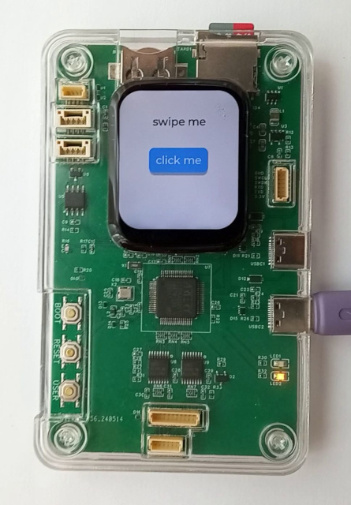

# at32f405-app

[](doc/at32f405-tool.jpeg)

This is an arm  debugger. The project consists of hardware, bootloader and application:

- [hardware project](https://oshwlab.com/koendv/at32f405-tool).
- [bootloader](https://github.com/koendv/at32f405-uf2boot)
- [application](https://github.com/koendv/at32f405-app)

This git is the debugger application. This is work in progress. The hardware is finished. A first preliminary software has been released.

## goal

A debugger that can be used

- connected to a computer
- standalone, logging everything to sdcard.

## hardware

- Artery (雅特力) [AT32F405RCT7](https://www.arterychip.com/en/product/AT32F405.jsp), 256 kbyte flash, 96 kbyte ram, 216MHz.
- 16 MByte QUAD SPI flash for XIP "execute-in-place" firmware and fonts.
- 280x240 LCD display with capacitive touch
- ambient light sensor to set LCD brightness
- SD card, useful for storing firmware images and data logging.
- CAN bus, 1 Mbit/s
- DS3231 real-time clock with battery back-up, in order to have logfiles with meaningful timestamps, and to be able to set alarms to wake up the processor.
- One high-speed USB, 480 Mbit/s
- One full-speed USB, 12 MBit/s.
- logic translators for target logic levels below 3.3V
- QWIIC I2C connector

The box is 3D printed in transparent resin, so the ambient light sensor is exposed to light. The cable to connect to the target is a "JST SH 1.0mm to Dupont".

[easyeda](https://easyeda.com/) was used to draw the schematic and the pcb. [jlcpcb](https://jlcpcb.com/) assembled the board and 3D-printed the enclosure. The hardware project is at [oshwlab](https://oshwlab.com/koendv/at32f405-tool).

## bootloader

The internal flash is 256 kbyte; the app is 620 kbyte. Because the application is too big for the internal flash, the application runs from external quad spi flash. A bootloader is needed to write the app in QSPI flash. The bootloader itself runs in internal flash.

To enter the bootloader, click the reset button twice, fast. The bootloader shows up on the pc as a mass storage device (a usb stick). Copying the app to the mass storage device writes the app to the QSPI flash.

The bootloader is on [github](https://github.com/koendv/at32f405-uf2boot).

## application

The application is made of several open source projects.

- [free-dap](https://github.com/ataradov/free-dap) debugger probe, for use with openocd
- [Black Magic Debug](https://github.com/blackmagic-debug/blackmagic), for use with gdb or standalone
- [tinyuf2](https://github.com/adafruit/tinyuf2) uf2 loader
- [CherryUSB](https://github.com/cherry-embedded/CherryUSB) usb protocol stack
- [CherryDAP](https://github.com/cherry-embedded/CherryDAP) winusb descriptors
- [RT-Thread](https://github.com/RT-Thread/rt-thread) operating system

The high-speed usb has different interfaces:

- bulk usb for CMSIS-DAP
- cdc serial for Black Magic Debug
- cdc serial for UART
- usb mass storage device for UF2

## display

The capacitive touch screen is from a smartwatch, and uses [LVGL](https://lvgl.io/) graphics. The gesture decoding is done in the touch screen itself. The interface is limited to clicks and swipes, but has the advantage of being very light on the cpu. A click or swipe is only a single interrupt. There is no touchscreen polling, no gesture decoding in software.

## building

The RT-Thread operating system has an IDE, [RT-Thread Studio](https://www.rt-thread.io/studio.html),  and a command-line build system, [env](https://github.com/RT-Thread/env). I develop using the command line on linux.

### source tree

Set up the source tree.

```sh
git clone https://github.com/RT-Thread/rt-thread
cd rt-thread/
git checkout ebe2926cd610661e210b70be1a22bac13923f4fb
cd bsp/at32/
git clone --recursive https://github.com/koendv/at32f405-app/
cd at32f405-app
pkgs --update
cd packages/LVGL-v9.1.0/
patch -p0 < ../../patches/lvgl-9.1.0-event-double-clicked.patch
patch -p0 < ../../patches/lvgl-9.1.0-rtthread.patch
# back to rt-thread top
cd ../../../../..
patch -p1 < bsp/at32/at32f405-app/patches/usb_dc_dwc2.patch
patch -p1 < bsp/at32/at32f405-app/patches/drv_hard_i2c.patch
patch -p1 < bsp/at32/at32f405-app/patches/drv_spi.patch
patch -p1 < bsp/at32/at32f405-app/patches/at32f402_405_can.patch
```
### compiling
Set up the [xpack](https://github.com/xpack-dev-tools/arm-none-eabi-gcc-xpack/releases/tag/v12.3.1-1.2) arm-none-eabi-gcc compiler.
Set up the  [env](https://github.com/RT-Thread/env) build environment. Install [bin2uf2](https://github.com/tinyvision-ai-inc/uf2-utils).

Compile first the .elf, and then the .uf2 binary.

```sh
cd rt-thread/bsp/at32/at32f405-app/
# compile rtthread.elf
scons
# extract binary from elf
arm-none-eabi-objcopy -O binary rtthread.elf rtthread.bin
# uf2 family id 0xf35c900d load address 0x90000000
bin2uf2 -f 0xf35c900d -o rtthread.uf2 0x90000000 rtthread.bin
```

## installing

- Following the instructions at [at32f405-uf2boot](https://github.com/koendv/at32f405-uf2boot), set up the bootloader.
- To enter the bootloader, click the reset button twice, with little time between the two clicks.
- The green LED lights, and a usb mass storage device CherryUF2 appears.
- To write the rtthread.uf2 binary to qspi flash:

```sh
$ cd rt-thread/bsp/at32/at32f405-app
$ ls -l rtthread.uf2
-rw-rw-r-- 1 koen koen 1259520 Sep 21 11:12 rtthread.uf2
$ ls /media/koen/CherryUF2/
CURRENT.UF2  INDEX.HTM  INFO_UF2.TXT
$ cp rtthread.uf2 /media/koen/CherryUF2/CURRENT.UF2
```
If a terminal is connected to the board console, a dot ```.``` is printed for every 4 kbyte written. When the file copy is finished, the rt-thread prompt appears at the console. The display initializes. The yellow led blinks every five seconds.

If the high-speed usb is connected to a pc, a usb device appears. This time, the usb mass storage device is called "UF2BOOT". It is not the bootloader. If you copy a binary to the UF2BOOT/CURRENT.UF2 file, the target system is flashed.

## debugging

This board uses an AT32F405 processor.
To debug an AT32F405 processor, openocd and black magic probe can be used

### openocd

Using [openocd](https://github.com/ArteryTek/openocd) from ArteryTek. Connect a CMSIS-DAP probe to the AT32F405 SWD port.  Command line:
```sh
openocd -f interface/cmsis-dap.cfg -f target/at32f402xx.cfg
```

### black magic probe

Using [black magic probe](https://black-magic.org/index.html). First [add support for AT32F405](applications/blackmagic-rtthread/patches/at32f405.patch). Compile and install the firmware. Connect black magic probe to the AT32F405 SWD port. Command line:

```sh
$ arm-none-eabi-gdb -q
(gdb) tar ext /dev/ttyACM0
(gdb) mon swd
Available Targets:
No. Att Driver
 1      AT32F402/405 M4
(gdb) at 1
(gdb) file rtthread.elf
(gdb) where
```
## changelog
[Changelog](CHANGELOG.md) where I keep track of progress.

## links

- [P169H002](https://aliexpress.com/wholesale?SearchText=P169H002&sortType=total_tranpro_desc) capacitive touch screen
- [easyeda](https://easyeda.com/) CAD software
- [LCSC](https://www.lcsc.com/) and [SZLCSC](https://www.szlcsc.com/) electronics components
- [jlcdfm](https://jlcdfm.com/) design for manufacturing
- [jlcpcb](https://jlcpcb.com/) pcb assembly and 3D printing
- [oshwlab](https://oshwlab.com) and [oshwhub](https://oshwhub.com/) open hardware projects
